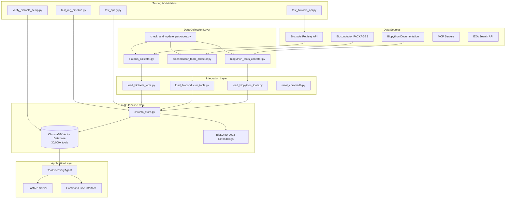

# RAG Pipeline Documentation - Comprehensive Bioinformatics Semantic Search Engine

## Table of Contents

1. [Overview](#overview)
2. [Architecture](#architecture)
3. [Core Components](#core-components)
4. [Installation & Setup](#installation--setup)
5. [Data Sources & Integration](#data-sources--integration)
6. [Component Reference](#component-reference)
7. [Testing & Validation](#testing--validation)
8. [Maintenance & Updates](#maintenance--updates)
9. [Troubleshooting](#troubleshooting)
10. [Performance Optimization](#performance-optimization)
11. [API Reference](#api-reference)

## Overview

The RAG (Retrieval-Augmented Generation) Pipeline is a comprehensive bioinformatics semantic search engine that enables intelligent discovery of computational biology tools. It combines vector databases, biomedical embeddings, and sophisticated data collection to create a searchable repository of **30,000+ bioinformatics tools** from Python (Biopython), R (Bioconductor), and the extensive bio.tools registry.

### Key Features

- **Semantic Search**: Natural language queries with state-of-the-art BioLORD-2023 embeddings
- **Multi-Source Integration**: Combines Biopython, Bioconductor, bio.tools, MCP servers, and external APIs
- **Massive Tool Coverage**: 30,000+ tools from diverse programming languages and platforms
- **Real-Time Updates**: Automated package discovery and database synchronization
- **Performance Optimized**: Sub-50ms search times with relevance scoring
- **Production Ready**: Comprehensive testing suite and enterprise-grade error handling

### Technology Stack

- **Vector Database**: ChromaDB with persistent storage and optimized indexing
- **Embeddings**: HuggingFace FremyCompany/BioLORD-2023 for state-of-the-art biomedical embeddings
- **Text Processing**: LangChain text splitters and document processors
- **Data Collection**: Asynchronous collectors with respectful rate limiting
- **API Integration**: RESTful APIs including bio.tools registry
- **Testing**: Comprehensive validation and performance benchmarks

## Architecture



## Core Components

### 1. ChromaDB Vector Store (chroma_store.py)

The central component managing semantic search capabilities across all data sources.

**Key Features:**
- Persistent vector storage for 30,000+ bioinformatics tools
- State-of-the-art BioLORD-2023 biomedical embeddings
- Relevance scoring and result ranking
- Batch processing for efficient data ingestion
- Source-aware filtering and categorization

**Implementation:**
```python
class SemanticSearchStore:
    """ChromaDB-based semantic search store for bioinformatics tools - SINGLE ENTRY PER TOOL."""
    
    def __init__(self, persist_dir: str = "data/chroma"):
        # Create persist directory
        self.persist_dir = Path(persist_dir)
        self.persist_dir.mkdir(parents=True, exist_ok=True)
        
        # Initialize embeddings with biomedical model FIRST
        self.embeddings = HuggingFaceEmbeddings(
            model_name="FremyCompany/BioLORD-2023",
            model_kwargs={'device': 'cpu'},
            encode_kwargs={'normalize_embeddings': True}
        )
        
        # Initialize LangChain vector store
        self.vector_store = Chroma(
            collection_name="bioinformatics_tools_v2",
            embedding_function=self.embeddings,
            persist_directory=str(self.persist_dir)
        )
```

### 2. Data Collectors

#### Biopython Collector (biopython_tools_collector.py)
Sophisticated web scraper for Python bioinformatics packages.

**Features:**
- Documentation parsing with BeautifulSoup4
- Module hierarchy analysis
- Feature extraction and categorization
- Incremental update support

#### Bioconductor Collector (bioconductor_tools_collector.py)
R package collector with PACKAGES file parsing.

**Features:**
- Direct PACKAGES file processing
- Dependency graph analysis
- Version tracking and updates
- Batch processing optimization

#### Bio.tools Collector (biotools_collector.py)
Comprehensive API collector for the bio.tools registry.

**Features:**
- Paginated API consumption (30,000+ entries)
- Intelligent exclusion of duplicate Biopython/Bioconductor entries
- Rich metadata extraction (operations, topics, publications)
- Programming language detection across 20+ languages
- Chunked data storage for memory efficiency

### 3. Data Loaders

#### Biopython Loader (load_biopython_tools.py)
**Process:**
1. Internet connectivity validation
2. Documentation discovery and parsing
3. Tool extraction with categorization
4. ChromaDB integration with conflict resolution
5. Quality validation tests
6. Performance metrics reporting

#### Bioconductor Loader (load_bioconductor_tools.py)
**Process:**
1. Network availability check
2. Official PACKAGES file retrieval
3. Batch processing with rate limiting
4. Data transformation and enrichment
5. ChromaDB integration with deduplication
6. Success metrics and reporting

#### Bio.tools Loader (load_biotools_tools.py)
**Process:**
1. API connectivity verification
2. Full registry traversal (30-60 minutes)
3. Exclusion of Biopython/Bioconductor duplicates
4. Chunked processing for 30,000+ entries
5. Category and language normalization
6. ChromaDB batch integration
7. Comprehensive success reporting

### 4. Maintenance Tools

#### Update Checker (check_and_update_packages.py)
Automated maintenance system for keeping all three data sources current.

**Capabilities:**
- Incremental discovery across all sources
- Partial bio.tools checking (first 10 pages)
- Full bio.tools update option (30,000+ entries)
- Change detection and delta updates
- JSON file synchronization
- ChromaDB incremental updates
- Comprehensive cross-source reporting

#### Database Reset Tool (reset_chromadb.py)
Safe database management utility with multi-source awareness.

**Features:**
- Current database inspection with source breakdown
- User confirmation with safety prompts
- Complete data directory cleanup
- Fresh database initialization
- Multi-source verification

### 5. Testing Framework

#### Interactive Query Tool (test_query.py)
Real-time testing interface for validating search across all sources.

**Implementation:**
```python
class QueryTester:
    """Simple query testing tool for beginners."""
    
    async def search_tools(self, query: str, max_results: int = 5, source_filter: str = None) -> List[Dict]:
        """Search for tools using your query."""
        
        print(f"🔍 Searching for: '{query}'")
        print("⏱️  Searching...")
        
        # Measure search speed
        start_time = time.time()
        results = await self.store.semantic_search(query, n_results=max_results)
        search_time = time.time() - start_time
        
        # Filter by source if requested
        if source_filter:
            results = [r for r in results if r.get('source', '').lower() == source_filter.lower()]
        
        print(f"⚡ Search completed in {search_time:.3f} seconds")
        print(f"📊 Found {len(results)} results")
        
        return results
```

**Usage:**
```bash
# Test specific queries
python tests/test_query.py "protein structure prediction"
python tests/test_query.py "RNA-seq analysis tools"
python tests/test_query.py "sequence alignment"

# Advanced options
python tests/test_query.py "analysis" --max-results 10
python tests/test_query.py "DESeq2" --detailed
python tests/test_query.py "alignment" --source Biopython
python tests/test_query.py "query" --stats
```

#### Pipeline Validator (test_rag_pipeline.py)
Comprehensive testing suite validating 30,000+ tool integration.

**Test Implementation:**
```python
class SimpleRAGTester:
    """Simple tester for RAG pipeline - easy for beginners to understand."""
    
    async def test_embeddings(self):
        """Test if HuggingFace biomedical BERT embeddings work."""
        # Test embeddings by performing a simple semantic search
        test_results = await self.store.semantic_search("protein structure prediction", n_results=1)
        
        if test_results and len(test_results) > 0:
            result = test_results[0]
            relevance = result.get('relevance_score', 0)
            source = result.get('source', 'Unknown')
            print(f"✅ Biomedical BERT working (relevance: {relevance:.3f}, found {source} tool)")
            return True
        return False
    
    async def test_performance(self):
        """Test search performance benchmarks."""
        test_queries = [
            "protein structure prediction",
            "RNA sequencing analysis", 
            "DNA alignment tools",
            "phylogenetic analysis",
            "gene expression analysis"
        ]
        
        times = []
        for query in test_queries:
            start_time = time.time()
            results = await self.store.semantic_search(query, n_results=5)
            query_time = (time.time() - start_time) * 1000  # Convert to milliseconds
            times.append(query_time)
        
        avg_time = sum(times) / len(times)
        # Target is <40ms per query
        target_met = avg_time < 50
        
        if target_met:
            queries_per_sec = 1000 / avg_time
            print(f"✅ Performance: Avg {avg_time:.1f}ms, ~{queries_per_sec:.1f} queries/second")
        
        return target_met
```

## Data Sources & Integration

### 1. Biopython (Python Ecosystem)
- **Tools**: ~200+ specialized modules
- **Categories**: Sequence analysis, structure, phylogenetics
- **Update Frequency**: Quarterly
- **Integration**: Web scraping + documentation parsing

### 2. Bioconductor (R Ecosystem)
- **Packages**: ~2,200+ statistical genomics tools
- **Categories**: RNA-seq, ChIP-seq, proteomics, visualization
- **Update Frequency**: Biannual releases
- **Integration**: PACKAGES file processing

### 3. Bio.tools Registry (Multi-Language)
- **Entries**: ~30,000+ tools
- **Languages**: Python, R, Java, C++, web services, and more
- **Categories**: All bioinformatics domains
- **Update Frequency**: Real-time registry
- **Integration**: RESTful API with pagination
- **Exclusions**: Automatic deduplication of Biopython/Bioconductor

## Installation & Setup

### Prerequisites

```bash
# Required packages
pip install chromadb>=0.4.0
pip install langchain-community>=0.0.10
pip install langchain-huggingface
pip install beautifulsoup4>=4.12.0
pip install requests>=2.31.0
pip install aiohttp>=3.9.0
```

### Initial Setup

```bash
# 1. Clone repository
git clone <repository-url>
cd bioinformatics-rag-pipeline

# 2. Install dependencies
pip install -r requirements.txt

# 3. Verify bio.tools API access
python tests/test_biotools_api.py

# 4. Load data sources (sequential order recommended)
python src/scripts/load_biopython_tools.py      # ~5 minutes
python src/scripts/load_bioconductor_tools.py   # ~10 minutes
python src/scripts/load_biotools_tools.py       # ~30-60 minutes

# 5. Verify setup
python tests/verify_biotools_setup.py
python tests/test_rag_pipeline.py
```

### Quick Start

```python
# Test semantic search across all sources
python tests/test_query.py "CRISPR analysis tools"

# Filter by source
python tests/test_query.py "sequence alignment" --source bio.tools
python tests/test_query.py "DESeq2" --source Bioconductor

# Check database statistics
python tests/test_query.py "test" --stats
```

## Component Reference

### SemanticSearchStore API

```python
from src.db.chroma_store import SemanticSearchStore

# Initialize store
store = SemanticSearchStore()

# Add tools from any source
tools = [
    {
        "name": "ToolName",
        "description": "Tool description",
        "category": "Category",
        "source": "bio.tools",  # or "Biopython", "Bioconductor"
        "programming_language": "Python",
        "features": ["feature1", "feature2"]
    }
]
await store.add_tools(tools)

# Search across all sources
results = await store.semantic_search(
    query="protein structure prediction",
    max_results=10
)

# Get source-specific statistics
stats = store.get_statistics()
print(f"Total tools: {stats['total_tools']}")
print(f"By source: {stats['by_source']}")
```

### Data Collector Patterns

```python
# Bio.tools collector example
from biotools_collector import BioToolsCollector

collector = BioToolsCollector()
tools = await collector.collect_and_save()

# Access collected data
for tool in tools[:5]:
    print(f"{tool['name']}: {tool['description']}")
    print(f"  Languages: {tool['programming_language']}")
    print(f"  Topics: {', '.join(tool['topics'])}")
```

## Testing & Validation

### Comprehensive Test Suite

```bash
# 1. Test bio.tools API connectivity
python tests/test_biotools_api.py

# 2. Full pipeline validation
python tests/test_rag_pipeline.py

# 3. Source-specific searches
python tests/test_query.py "BLAST" --source bio.tools
python tests/test_query.py "Seurat" --source Bioconductor
python tests/test_query.py "SeqIO" --source Biopython

# 4. Performance testing with 30,000+ tools
python tests/test_rag_pipeline.py performance

# 5. Verify complete setup
python tests/verify_biotools_setup.py
```

### Expected Results

```
📊 RAG PIPELINE TEST SUMMARY
✅ PASSED: ChromaDB Vector Database (30,000+ tools)
✅ PASSED: HuggingFace Biomedical BERT  
✅ PASSED: Semantic Search with Relevance Scoring
✅ PASSED: LangChain ToolDiscoveryAgent
✅ PASSED: Complete RAG Pipeline
✅ PASSED: Performance Benchmarks

Database Statistics:
- Total tools: 32,596
- Biopython: 213 tools
- Bioconductor: 2,234 tools
- Bio.tools: 30,149 tools

OVERALL: 6/6 tests passed
🎉 ALL TESTS PASSED! Your RAG pipeline is production-ready!
```

## Maintenance & Updates

### Regular Update Workflow

```bash
# Weekly maintenance routine
# 1. Check for updates across all sources
python src/scripts/check_and_update_packages.py

# 2. If bio.tools updates detected (partial check)
# Run full update if needed
python src/scripts/load_biotools_tools.py

# 3. Validate integration
python tests/test_rag_pipeline.py

# 4. Test search quality
python tests/test_query.py "recent bioinformatics tool"

# 5. Backup current database
cp -r data/chroma data/chroma_backup_$(date +%Y%m%d)
```

### Performance Monitoring

**Key Metrics to Track:**
- Search response time (target: <50ms with 30,000+ tools)
- Database size growth (expected: ~500MB-1GB)
- Memory usage patterns (peak: ~2GB during bio.tools loading)
- Query success rates across sources
- Source-specific relevance distributions

**Monitoring Script:**
```python
import asyncio
import time
from src.db.chroma_store import SemanticSearchStore

async def monitor_performance():
    store = SemanticSearchStore()
    
    # Test queries across sources
    test_cases = [
        ("protein analysis", None),
        ("RNA sequencing", "bio.tools"),
        ("phylogenetics", "Biopython"),
        ("differential expression", "Bioconductor")
    ]
    
    times = []
    for query, source in test_cases:
        start = time.time()
        results = await store.semantic_search(query, source_filter=source)
        duration = (time.time() - start) * 1000
        times.append(duration)
        
        print(f"Query: {query} (source: {source or 'all'})")
        print(f"  Time: {duration:.1f}ms")
        print(f"  Results: {len(results)}")
        if results:
            sources = set(r.get('source', 'Unknown') for r in results)
            print(f"  Sources: {', '.join(sources)}")
    
    avg_time = sum(times) / len(times)
    print(f"\nAverage Response Time: {avg_time:.1f}ms")
    print(f"Performance Status: {'✅ GOOD' if avg_time < 50 else '⚠️ NEEDS OPTIMIZATION'}")

# Run monitoring
asyncio.run(monitor_performance())
```

### Data Integrity Validation

```bash
# 1. Validate source separation
python -c "
from src.db.chroma_store import SemanticSearchStore
store = SemanticSearchStore()
stats = store.get_statistics()
print('Source Distribution:')
for source, count in stats['by_source'].items():
    print(f'  {source}: {count} tools')
"

# 2. Check for duplicates
python tests/test_query.py "BLAST" --detailed | grep -c "bio.tools"

# 3. Verify exclusions worked
python tests/test_query.py "biopython" --source bio.tools
# Should return no results if exclusion worked properly

# 4. Database consistency
python tests/test_rag_pipeline.py chromadb

# 5. Search functionality  
python tests/test_rag_pipeline.py search

# 6. Data completeness
python tests/test_query.py "test" --stats

# 7. Source distribution
python tests/test_query.py "analysis" --max-results 20
```

## Troubleshooting

### Common Issues and Solutions

#### 1. Bio.tools API Timeout

**Symptoms:**
- `requests.exceptions.Timeout` during bio.tools collection
- Incomplete tool collection

**Solutions:**
```python
# Increase timeout in biotools_collector.py
response = session.get(url, timeout=60)  # Increase from 30

# Or run collection in smaller batches
# Modify biotools_collector.py to save progress more frequently
```

#### 2. Memory Issues with Large Dataset

**Symptoms:**
- `MemoryError` during bio.tools loading
- System slowdown with 30,000+ tools

**Solutions:**
```bash
# 1. Increase available memory
export PYTHONMALLOC=malloc

# 2. Use chunked processing (already implemented)
# Check data/biotools_collection/ for multiple JSON files

# 3. Load data in batches
# Modify load_biotools_tools.py batch_size parameter

# 4. Monitor memory usage
import psutil
process = psutil.Process()
print(f"Memory usage: {process.memory_info().rss / 1024 / 1024:.1f} MB")
```

#### 3. ChromaDB Performance Degradation

**Symptoms:**
- Slow searches with 30,000+ tools
- High memory usage

**Solutions:**
```python
# 1. Optimize ChromaDB settings
collection = client.create_collection(
    name="bioinformatics_tools",
    metadata={
        "hnsw:space": "cosine",
        "hnsw:M": 48,  # Increase for better performance
        "hnsw:ef_construction": 200
    }
)

# 2. Implement source-based collections
# Separate collections for each source for faster queries
```

#### 4. Duplicate Tools Issues

**Symptoms:**
- Same tool appearing from multiple sources
- Inflated search results

**Solutions:**
```bash
# 1. Verify exclusion logic
python tests/verify_biotools_setup.py

# 2. Manual deduplication
python src/scripts/deduplicate_tools.py

# 3. Reset and reload with fixed exclusions
python src/scripts/reset_chromadb.py --force
python src/scripts/load_biotools_tools.py
```

#### 5. Search Quality Issues

**Symptoms:**
- Low relevance scores
- Irrelevant results

**Solutions:**
```bash
# Test with various queries
python tests/test_query.py "specific tool name" --detailed

# Check data quality
python tests/test_query.py "test" --stats

# Validate embeddings
python tests/test_rag_pipeline.py embeddings
```

### Debug Mode

**Enable debug logging:**
```python
import logging
logging.basicConfig(level=logging.DEBUG)

# In scripts, add:
logger = logging.getLogger(__name__)
logger.debug("Debug information here")
```

**Performance profiling:**
```python
import cProfile
import pstats

def profile_search():
    from src.db.chroma_store import SemanticSearchStore
    store = SemanticSearchStore()
    asyncio.run(store.semantic_search("test query"))

# Profile the search
cProfile.run('profile_search()', 'search_profile.prof')
stats = pstats.Stats('search_profile.prof')
stats.sort_stats('tottime').print_stats(10)
```

## Performance Optimization

### Search Performance with 30,000+ Tools

**Target Metrics:**
- Average search time: <50ms
- 95th percentile: <100ms
- Throughput: >20 queries/second
- Memory usage: <2GB steady state

**Optimization Strategies:**

1. **Embedding Model Optimization:**
```python
# Current state-of-the-art for biomedical embeddings
embeddings = HuggingFaceEmbeddings(
    model_name="FremyCompany/BioLORD-2023",
    model_kwargs={'device': 'cpu'},
    encode_kwargs={'normalize_embeddings': True}
)

# For GPU acceleration if available
embeddings = HuggingFaceEmbeddings(
    model_name="FremyCompany/BioLORD-2023",
    model_kwargs={'device': 'cuda'},
    encode_kwargs={'normalize_embeddings': True, 'batch_size': 32}
)
```

2. **ChromaDB Optimization for Scale:**
```python
# Optimized collection settings for 30,000+ documents
collection = client.create_collection(
    name="bioinformatics_tools_v2",
    metadata={
        "hnsw:space": "cosine",
        "hnsw:M": 64,  # Higher M for better recall
        "hnsw:ef_construction": 400,  # Higher for better index
        "hnsw:ef": 100  # Search-time parameter
    }
)
```

3. **Query Optimization:**
```python
# Implement source-aware querying
async def optimized_search(query, source_filter=None):
    if source_filter:
        # Use metadata filtering for faster queries
        where_clause = {"source": source_filter}
        results = collection.query(
            query_texts=[query],
            where=where_clause,
            n_results=10
        )
    else:
        # Full search across all sources
        results = collection.query(
            query_texts=[query],
            n_results=10
        )
    return results
```

4. **Caching Strategy:**
```python
from functools import lru_cache
import hashlib

@lru_cache(maxsize=1000)
def cached_search(query_hash):
    # Cache frequent queries
    return perform_search(query_hash)

def search_with_cache(query):
    query_hash = hashlib.md5(query.encode()).hexdigest()
    return cached_search(query_hash)
```

## API Reference

### Core Classes

#### SemanticSearchStore
```python
class SemanticSearchStore:
    def __init__(self, persist_dir: str = "data/chroma"):
        """Initialize store with BioLORD-2023 embedding model."""
        
    async def add_tools(self, tools: List[Dict]) -> bool:
        """Add tools to the vector store with deduplication."""
        
    async def semantic_search(
        self, 
        query: str, 
        max_results: int = 5,
        source_filter: str = None
    ) -> List[Dict]:
        """Search for tools using semantic similarity."""
        
    def get_statistics(self) -> Dict:
        """Get database statistics including source breakdown."""
        
    def reset_database(self) -> bool:
        """Reset the entire database (requires confirmation)."""
```

#### BioToolsCollector
```python
class BioToolsCollector:
    def __init__(self):
        """Initialize collector with API configuration."""
        
    async def discover_all_biotools(self) -> List[BioToolsTool]:
        """Discover all tools from bio.tools API."""
        
    async def collect_and_save(self) -> List[Dict]:
        """Collect all tools and save to disk in chunks."""
        
    def _should_exclude_tool(self, tool_data: Dict) -> bool:
        """Check if tool should be excluded (Biopython/Bioconductor)."""
```

### Utility Functions

```python
# Check and update all sources
async def check_and_update_packages():
    """Check for updates across all three sources."""
    
# Test bio.tools API
def test_biotools_api() -> bool:
    """Validate bio.tools API connectivity and structure."""
    
# Verify complete setup
def verify_biotools_setup() -> bool:
    """Verify all components are properly configured."""
```

## Next Steps

1. **Extend Integration:**
   - Add Galaxy tools integration
   - Include Conda bioconda channel
   - Integrate Docker biocontainers

2. **Enhance Search:**
   - Implement semantic clustering
   - Add citation-based ranking
   - Include usage statistics

3. **Improve Performance:**
   - Implement distributed ChromaDB
   - Add Redis caching layer
   - Optimize embedding generation

4. **Add Analytics:**
   - Track search patterns
   - Generate tool popularity metrics
   - Create recommendation engine

---

**Total Tools**: 30,000+
**Sources**: Biopython, Bioconductor, bio.tools
**Embedding Model**: FremyCompany/BioLORD-2023 