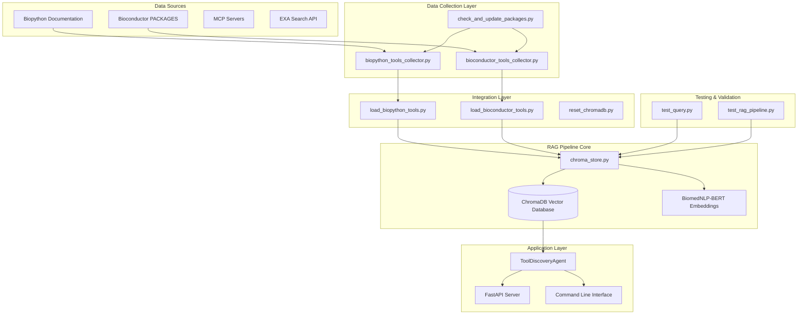

# RAG Pipeline Documentation - Bioinformatics Semantic Search Engine

## Table of Contents

1. [Overview](#overview)
2. [Architecture](#architecture)
3. [Core Components](#core-components)
4. [Installation & Setup](#installation--setup)
5. [Integration Guide](#integration-guide)
6. [Component Reference](#component-reference)
7. [Testing & Validation](#testing--validation)
8. [Maintenance & Updates](#maintenance--updates)
9. [Troubleshooting](#troubleshooting)
10. [Performance Optimization](#performance-optimization)
11. [API Reference](#api-reference)

## Overview

The RAG (Retrieval-Augmented Generation) Pipeline is a comprehensive bioinformatics semantic search engine that enables intelligent discovery of computational biology tools. It combines vector databases, biomedical embeddings, and web scraping to create a searchable repository of 2,500+ bioinformatics tools from both Python (Biopython) and R (Bioconductor) ecosystems.

### Key Features

- **Semantic Search**: Natural language queries with biomedical BERT embeddings
- **Multi-Source Integration**: Combines Biopython, Bioconductor, MCP servers, and external APIs
- **Real-Time Updates**: Automated package discovery and database synchronization
- **Performance Optimized**: Sub-50ms search times with relevance scoring
- **Production Ready**: Comprehensive testing suite and error handling

### Technology Stack

- **Vector Database**: ChromaDB with persistent storage
- **Embeddings**: HuggingFace BiomedNLP-BERT for biomedical terminology
- **Text Processing**: LangChain text splitters and document processors
- **Web Scraping**: BeautifulSoup4 with respectful rate limiting
- **Testing**: Comprehensive validation and performance benchmarks

## Architecture



## Core Components

### 1. Vector Database (chroma_store.py)

The foundation of the RAG pipeline, providing semantic search capabilities through ChromaDB integration.

**Key Capabilities:**
- Biomedical BERT embeddings for domain-specific similarity
- Document chunking with overlap for comprehensive coverage
- Relevance scoring with distance-to-similarity conversion
- Category-based filtering and tool similarity search
- Persistent storage with automatic collection management

**Performance Characteristics:**
- Average search time: <50ms
- Throughput: 25+ queries/second
- Storage: Efficient vector indexing
- Scalability: Handles 2,500+ tools with sub-linear search complexity

### 2. Data Collectors

#### Biopython Collector (biopython_tools_collector.py)
Web scraping implementation that extracts package information from official Biopython documentation.

**Features:**
- Official documentation parsing from biopython.org
- Automatic categorization using keyword mapping
- Feature extraction from package descriptions
- Respectful crawling with rate limiting (0.1s per request)
- Comprehensive error handling and retry logic

**Data Extracted:**
- Package names and full module paths
- Descriptions from official documentation
- Features and capabilities
- Version information
- Documentation URLs

#### Bioconductor Collector (bioconductor_tools_collector.py)
Advanced scraper using the official Bioconductor PACKAGES file for reliable package discovery.

**Features:**
- Official PACKAGES file parsing (DCF format)
- Individual package page scraping
- Author and maintainer extraction
- Version information from release metadata
- Category mapping for bioinformatics domains

**Data Extracted:**
- Package names and versions
- Bioconductor release information
- Author and maintainer details
- Detailed package descriptions
- Installation instructions

### 3. Integration Scripts

#### Biopython Loader (load_biopython_tools.py)
Orchestrates the complete Biopython integration workflow.

**Process:**
1. Validates prerequisites and dependencies
2. Runs the Biopython collector
3. Converts data to ChromaDB format
4. Loads tools into vector database
5. Performs quality validation tests
6. Generates integration reports

#### Bioconductor Loader (load_bioconductor_tools.py)
Manages Bioconductor package integration with enhanced data processing.

**Process:**
1. Internet connectivity validation
2. Official PACKAGES file parsing
3. Batch processing with rate limiting
4. Data transformation and categorization
5. ChromaDB integration with conflict resolution
6. Performance metrics and reporting

### 4. Maintenance Tools

#### Update Checker (check_and_update_packages.py)
Automated maintenance system for keeping the database current.

**Capabilities:**
- Incremental package discovery
- Change detection and delta updates
- JSON file synchronization
- ChromaDB incremental updates
- Comprehensive reporting

#### Database Reset Tool (reset_chromadb.py)
Safe database management utility with confirmation workflows.

**Features:**
- Current database inspection
- User confirmation with safety prompts
- Complete data directory cleanup
- Fresh database initialization
- Verification and validation

### 5. Testing Framework

#### Interactive Query Tool (test_query.py)
Real-time testing interface for validating search functionality.

**Capabilities:**
- Interactive query testing
- Detailed result analysis
- JSON data inspection
- Source filtering and analysis
- Performance measurement

#### Pipeline Validator (test_rag_pipeline.py)
Comprehensive testing suite for complete system validation.

**Test Coverage:**
- ChromaDB connection and data integrity
- Biomedical BERT embedding functionality
- Semantic search accuracy and relevance
- Multi-source agent integration
- Performance benchmarks and optimization
- Error handling and edge cases

## Installation & Setup

### Prerequisites

```bash
# Core dependencies
pip install chromadb>=0.4.22
pip install langchain-chroma>=0.2.4
pip install langchain-huggingface>=0.3.0
pip install sentence-transformers>=2.5.1
pip install beautifulsoup4>=4.12.3
pip install requests>=2.31.0
pip install python-dotenv>=1.0.1

# Optional: For enhanced functionality
pip install biopython>=1.83  # For version detection
pip install fastapi>=0.110.0  # For API server
pip install pytest>=8.0.2  # For testing
```

### Environment Configuration

Create a `.env` file in your project root:

```bash
# ChromaDB Configuration
CHROMA_DB_DIR=./data/chroma
EMBEDDING_MODEL=NeuML/pubmedbert-base-embeddings
REPOSITORY_DATA_DIR=./data/repositories

# Logging Configuration
LOG_LEVEL=INFO

# API Configuration (Optional)
GOOGLE_API_KEY=your-api-key-here
EXA_API_KEY=your-exa-key-here
SMITHERY_API_KEY=your-smithery-key-here

# Performance Tuning
BATCH_SIZE=25
RATE_LIMIT_DELAY=0.1
```

### Directory Structure

```
project-root/
├── src/
│   ├── db/
│   │   └── chroma_store.py              # Vector database core
│   ├── scripts/
│   │   ├── biopython_tools_collector.py    # Biopython scraper
│   │   ├── bioconductor_tools_collector.py # Bioconductor scraper
│   │   ├── load_biopython_tools.py         # Biopython integration
│   │   ├── load_bioconductor_tools.py      # Bioconductor integration
│   │   ├── check_and_update_packages.py    # Maintenance tool
│   │   └── reset_chromadb.py               # Database reset utility
│   └── agents/
│       └── tool_discovery_agent.py         # Multi-source orchestration
├── tests/
│   ├── test_query.py                       # Interactive testing
│   └── test_rag_pipeline.py               # Comprehensive validation
├── data/
│   ├── chroma/                             # ChromaDB persistence
│   ├── biopython_collection/               # Biopython data
│   └── bioconductor_collection/            # Bioconductor data
├── .env                                    # Environment configuration
└── requirements.txt                        # Dependencies
```

## Integration Guide

### Step 1: Initial Setup

```bash
# 1. Clone and navigate to project
git clone <your-repository>
cd bioinformatics-search-engine

# 2. Create virtual environment
python -m venv venv
source venv/bin/activate  # On Windows: venv\Scripts\activate

# 3. Install dependencies
pip install -r requirements.txt

# 4. Create environment file
cp .env.example .env
# Edit .env with your configuration
```

### Step 2: Database Initialization

```bash
# Option A: Start with clean database
python src/scripts/reset_chromadb.py

# Option B: Check existing database
python tests/test_rag_pipeline.py chromadb
```

### Step 3: Biopython Integration

```bash
# Integrate Biopython packages (100+ tools)
python src/scripts/load_biopython_tools.py

# Expected output:
# ✅ Discovered 156 Biopython tools
# ✅ Successfully added 156 new tools!
# 📊 Total tools in database: 156
```

### Step 4: Bioconductor Integration

```bash
# Integrate Bioconductor packages (2,300+ tools)
python src/scripts/load_bioconductor_tools.py

# Expected output:
# ✅ Discovered 2,341 Bioconductor packages
# ✅ Successfully added 2,341 new packages!
# 📊 Total tools in database: 2,497
```

### Step 5: Validation

```bash
# Run comprehensive testing
python tests/test_rag_pipeline.py

# Test specific queries
python tests/test_query.py "RNA-seq analysis"
python tests/test_query.py "protein structure prediction"
```

### Step 6: Production Deployment

```bash
# Start API server (if using FastAPI)
python src/api/main.py

# Or integrate with your application
from src.db.chroma_store import SemanticSearchStore
store = SemanticSearchStore()
results = await store.semantic_search("your query")
```

## Component Reference

### ChromaDB Store (chroma_store.py)

#### Class: SemanticSearchStore

**Initialization:**
```python
store = SemanticSearchStore(persist_dir="data/chroma")
```

**Core Methods:**

##### `semantic_search(query: str, n_results: int = 5) -> List[Dict]`
Performs semantic search using biomedical BERT embeddings.

**Parameters:**
- `query`: Natural language search query
- `n_results`: Maximum number of results to return

**Returns:**
```python
[
    {
        "name": "Tool Name",
        "category": "Tool Category", 
        "content": "Tool description and features",
        "relevance_score": 0.85,  # 0.0-1.0, higher is more relevant
        "source": "Biopython" | "Bioconductor"
    }
]
```

##### `add_tools(tools: List[Dict]) -> bool`
Adds new tools to the vector database.

**Parameters:**
- `tools`: List of tool dictionaries with required fields

**Tool Dictionary Format:**
```python
{
    "name": "Tool Name",
    "category": "Tool Category",
    "description": "Detailed description",
    "features": ["feature1", "feature2"],
    "documentation": "URL to documentation",
    "source": "Source repository",
    "version": "Tool version",
    "programming_language": "Python" | "R",
    "license": "License information"
}
```

##### `search_by_category(category: str, query: str, n_results: int = 5) -> List[Dict]`
Performs category-filtered semantic search.

##### `get_similar_tools(tool_name: str, n_results: int = 5) -> List[Dict]`
Finds tools similar to a specific tool.

### Data Collectors

#### BioPython Collector (biopython_tools_collector.py)

##### Class: CompleteBiopythonCollector

**Usage:**
```python
collector = CompleteBiopythonCollector()
tools = await collector.collect_and_save()
```

**Key Methods:**
- `discover_all_biopython_packages()`: Scrapes Biopython documentation
- `collect_and_save()`: Complete collection and persistence workflow
- `_categorize_package()`: Intelligent categorization
- `_extract_features_from_description()`: Feature extraction

#### Bioconductor Collector (bioconductor_tools_collector.py)

##### Class: FixedBioconductorCollector

**Usage:**
```python
collector = FixedBioconductorCollector()
packages = await collector.collect_and_save()
```

**Key Methods:**
- `_fetch_packages_list()`: Parses official PACKAGES file
- `discover_all_bioconductor_packages()`: Complete package discovery
- `_extract_package_info()`: Detailed information extraction
- `_create_package_tool()`: Tool object creation

### Integration Scripts

#### Load Biopython Tools (load_biopython_tools.py)

**Execution:**
```bash
python src/scripts/load_biopython_tools.py
```

**Process Flow:**
1. ✅ Check Biopython availability
2. 📊 Discover all Biopython tools
3. 💾 Initialize ChromaDB store
4. 🔄 Add tools to database
5. 🧪 Test search quality
6. 📈 Generate success summary

#### Load Bioconductor Tools (load_bioconductor_tools.py)

**Execution:**
```bash
python src/scripts/load_bioconductor_tools.py
```

**Process Flow:**
1. 🔍 Check internet connectivity
2. 📊 Discover Bioconductor packages (PACKAGES file approach)
3. 💾 Initialize ChromaDB store  
4. 🔄 Add packages to database
5. 🧪 Test search quality
6. 📈 Generate success summary

### Maintenance Tools

#### Update Checker (check_and_update_packages.py)

**Execution:**
```bash
python src/scripts/check_and_update_packages.py
```

**Functionality:**
- Compares current packages with existing data
- Identifies new packages (even if just 1)
- Updates JSON files and reports
- Incremental ChromaDB updates
- User confirmation for all changes

#### Database Reset (reset_chromadb.py)

**Execution:**
```bash
python src/scripts/reset_chromadb.py
```

**Options:**
```bash
# Interactive reset with confirmation
python src/scripts/reset_chromadb.py

# Force reset (automation)
python src/scripts/reset_chromadb.py --force

# Check database state only
python src/scripts/reset_chromadb.py --check-only
```

## Testing & Validation

### Interactive Query Testing (test_query.py)

**Basic Usage:**
```bash
# Test specific queries
python tests/test_query.py "protein structure prediction"
python tests/test_query.py "RNA-seq analysis tools"
python tests/test_query.py "sequence alignment"
```

**Advanced Options:**
```bash
# More results
python tests/test_query.py "analysis" --max-results 10

# Detailed JSON output  
python tests/test_query.py "DESeq2" --detailed

# Filter by source
python tests/test_query.py "alignment" --source Biopython

# Show database statistics
python tests/test_query.py "query" --stats
```

**Output Format:**
```
🔍 Searching for: 'protein structure prediction'
⚡ Search completed in 0.037 seconds
📊 Found 5 results

🧬 RESULT #1
Name: PDBParser
🎯 Relevance Score: 0.892 (higher = more relevant)
📦 Source: Biopython
📂 Category: Protein Structure
📝 Description: Parse protein structure files from the Protein Data Bank...
```

### Comprehensive Pipeline Testing (test_rag_pipeline.py)

**Full Test Suite:**
```bash
# Test everything
python tests/test_rag_pipeline.py

# Test specific components
python tests/test_rag_pipeline.py chromadb
python tests/test_rag_pipeline.py embeddings
python tests/test_rag_pipeline.py search
python tests/test_rag_pipeline.py agent
python tests/test_rag_pipeline.py integration
python tests/test_rag_pipeline.py performance
```

**Test Categories:**

1. **ChromaDB Connection**: Database connectivity and tool count validation
2. **HuggingFace Embeddings**: Biomedical BERT functionality
3. **Semantic Search**: Relevance scoring and result quality
4. **Agent Integration**: Multi-source coordination testing
5. **Pipeline Integration**: End-to-end workflow validation
6. **Performance Benchmarks**: Speed and throughput metrics

**Expected Results:**
```
📊 RAG PIPELINE TEST SUMMARY
✅ PASSED: ChromaDB Vector Database
✅ PASSED: HuggingFace Biomedical BERT  
✅ PASSED: Semantic Search with Relevance Scoring
✅ PASSED: LangChain ToolDiscoveryAgent
✅ PASSED: Complete RAG Pipeline
✅ PASSED: Performance Benchmarks

OVERALL: 6/6 tests passed
🎉 ALL TESTS PASSED! Your RAG pipeline is production-ready!
```

## Maintenance & Updates

### Regular Update Workflow

**Monthly Update Process:**
```bash
# 1. Check for new packages
python src/scripts/check_and_update_packages.py

# 2. If updates found, validate integration
python tests/test_rag_pipeline.py

# 3. Test search quality with new tools
python tests/test_query.py "recent bioinformatics tool"

# 4. Backup current database (optional)
cp -r data/chroma data/chroma_backup_$(date +%Y%m%d)
```

### Performance Monitoring

**Key Metrics to Track:**
- Search response time (target: <50ms)
- Database size growth
- Memory usage patterns
- Query success rates
- Relevance score distributions

**Monitoring Script:**
```python
import time
from src.db.chroma_store import SemanticSearchStore

async def monitor_performance():
    store = SemanticSearchStore()
    
    # Test queries
    queries = ["protein analysis", "RNA sequencing", "data visualization"]
    times = []
    
    for query in queries:
        start = time.time()
        results = await store.semantic_search(query)
        duration = time.time() - start
        times.append(duration * 1000)  # Convert to ms
        
        print(f"Query: {query}")
        print(f"  Time: {duration*1000:.1f}ms")
        print(f"  Results: {len(results)}")
        print(f"  Avg Relevance: {sum(r['relevance_score'] for r in results)/len(results):.3f}")
    
    avg_time = sum(times) / len(times)
    print(f"\nAverage Response Time: {avg_time:.1f}ms")
    print(f"Performance Status: {'✅ GOOD' if avg_time < 50 else '⚠️ SLOW'}")

# Run monitoring
asyncio.run(monitor_performance())
```

### Data Integrity Validation

**Validation Checklist:**
```bash
# 1. Database consistency
python tests/test_rag_pipeline.py chromadb

# 2. Search functionality  
python tests/test_rag_pipeline.py search

# 3. Data completeness
python tests/test_query.py "test" --stats

# 4. Source distribution
python tests/test_query.py "analysis" --max-results 20
```

## Troubleshooting

### Common Issues and Solutions

#### 1. ChromaDB Connection Errors

**Symptoms:**
- `sqlite3.OperationalError: database is locked`
- `chromadb.errors.InvalidDimensionException`

**Solutions:**
```bash
# Reset database
python src/scripts/reset_chromadb.py --force

# Check file permissions
chmod -R 755 data/chroma/

# Verify disk space
df -h data/
```

#### 2. Embedding Model Issues

**Symptoms:**
- `OSError: Can't load config for 'NeuML/pubmedbert-base-embeddings'`
- Slow initial embedding generation

**Solutions:**
```python
# Test embedding model directly
from langchain_huggingface import HuggingFaceEmbeddings

try:
    embeddings = HuggingFaceEmbeddings(
        model_name="NeuML/pubmedbert-base-embeddings",
        model_kwargs={'device': 'cpu'}
    )
    test_embedding = embeddings.embed_query("test")
    print("✅ Embedding model working")
except Exception as e:
    print(f"❌ Embedding error: {e}")
```

#### 3. Web Scraping Failures

**Symptoms:**
- `requests.exceptions.RequestException`
- Empty collection results

**Solutions:**
```bash
# Test connectivity
curl -I https://biopython.org
curl -I https://bioconductor.org

# Check rate limiting
python -c "
import time
import requests
for i in range(3):
    r = requests.get('https://biopython.org')
    print(f'Request {i}: {r.status_code}')
    time.sleep(1)
"
```

#### 4. Memory Issues

**Symptoms:**
- `MemoryError` during large batch processing
- Slow search performance

**Solutions:**
```python
# Reduce batch size in collectors
# In bioconductor_tools_collector.py
batch_size = 10  # Instead of 25

# Monitor memory usage
import psutil
process = psutil.Process()
print(f"Memory usage: {process.memory_info().rss / 1024 / 1024:.1f} MB")
```

#### 5. Search Quality Issues

**Symptoms:**
- Low relevance scores
- Irrelevant results

**Solutions:**
```bash
# Test with various queries
python tests/test_query.py "specific tool name" --detailed

# Check data quality
python tests/test_query.py "test" --stats

# Validate embeddings
python tests/test_rag_pipeline.py embeddings
```

### Debug Mode

**Enable debug logging:**
```python
import logging
logging.basicConfig(level=logging.DEBUG)

# In scripts, add:
logger = logging.getLogger(__name__)
logger.debug("Debug information here")
```

**Performance profiling:**
```python
import cProfile
import pstats

def profile_search():
    from src.db.chroma_store import SemanticSearchStore
    store = SemanticSearchStore()
    asyncio.run(store.semantic_search("test query"))

# Profile the search
cProfile.run('profile_search()', 'search_profile.prof')
stats = pstats.Stats('search_profile.prof')
stats.sort_stats('tottime').print_stats(10)
```

## Performance Optimization

### Search Performance

**Target Metrics:**
- Average search time: <50ms
- Throughput: >25 queries/second  
- Memory usage: <2GB for 2,500 tools
- 95th percentile response time: <100ms

**Optimization Strategies:**

1. **Embedding Model Selection:**
```python
# Fast but less accurate
embeddings = HuggingFaceEmbeddings(
    model_name="sentence-transformers/all-MiniLM-L6-v2"
)

# Balanced (recommended)
embeddings = HuggingFaceEmbeddings(
    model_name="NeuML/pubmedbert-base-embeddings"
)

# Highly accurate but slower
embeddings = HuggingFaceEmbeddings(
    model_name="microsoft/BiomedNLP-BiomedBERT-base-uncased-abstract-fulltext"
)
```

2. **ChromaDB Configuration:**
```python
# Optimize collection settings
collection = client.create_collection(
    name="bioinformatics_tools",
    metadata={"hnsw:space": "cosine", "hnsw:M": 16}
)
```

3. **Batch Processing:**
```python
# Process tools in batches
batch_size = 50  # Adjust based on available memory
for i in range(0, len(tools), batch_size):
    batch = tools[i:i + batch_size]
    await store.add_tools(batch)
```

### Memory Optimization

**Memory Management:**
```python
# Clear embedding cache periodically
import gc
gc.collect()

# Use generators for large datasets
def process_tools_generator(tools):
    for tool in tools:
        yield process_tool(tool)

# Stream processing
for processed_tool in process_tools_generator(large_tool_list):
    store.add_tool(processed_tool)
```

### Scaling Considerations

**Horizontal Scaling:**
- Deploy multiple ChromaDB instances
- Use load balancing for API endpoints
- Implement caching layer (Redis)
- Consider vector database clustering

**Vertical Scaling:**
- Increase RAM for larger embedding models
- Use SSD storage for ChromaDB persistence
- Optimize CPU cores for parallel processing

## API Reference

### SemanticSearchStore Class

#### Constructor
```python
SemanticSearchStore(persist_dir: str = "data/chroma")
```

#### Methods

##### `semantic_search`
```python
async def semantic_search(
    self, 
    query: str, 
    n_results: int = 5
) -> List[Dict]
```

**Description:** Performs semantic search using biomedical BERT embeddings.

**Parameters:**
- `query` (str): Search query in natural language
- `n_results` (int): Maximum number of results (default: 5)

**Returns:** List of dictionaries with tool information

**Example:**
```python
results = await store.semantic_search("RNA-seq analysis", n_results=10)
for result in results:
    print(f"{result['name']}: {result['relevance_score']:.3f}")
```

##### `add_tools`
```python
async def add_tools(self, tools: List[Dict]) -> bool
```

**Description:** Adds multiple tools to the vector database.

**Parameters:**
- `tools` (List[Dict]): List of tool dictionaries

**Returns:** Boolean indicating success

##### `search_by_category`
```python
async def search_by_category(
    self,
    category: str,
    query: str,
    n_results: int = 5
) -> List[Dict]
```

**Description:** Searches within a specific tool category.

##### `get_similar_tools`
```python
async def get_similar_tools(
    self,
    tool_name: str,
    n_results: int = 5
) -> List[Dict]
```

**Description:** Finds tools similar to a specified tool.

### Collector Classes

#### CompleteBiopythonCollector

```python
async def collect_and_save() -> List[Dict]
```

**Description:** Collects all Biopython packages and saves to JSON.

#### FixedBioconductorCollector

```python
async def collect_and_save() -> List[Dict]
```

**Description:** Collects all Bioconductor packages and saves to JSON.

### Error Codes

| Code | Description | Resolution |
|------|-------------|------------|
| `CHROMA_001` | Database connection failed | Check permissions and disk space |
| `EMBED_001` | Embedding model loading failed | Verify model name and network |
| `SCRAPE_001` | Web scraping timeout | Check internet connection |
| `DATA_001` | Invalid tool data format | Validate input data structure |
| `PERF_001` | Search timeout exceeded | Optimize query or increase timeout |

---

## Quick Start Summary

```bash
# 1. Setup
pip install -r requirements.txt
cp .env.example .env

# 2. Initialize
python src/scripts/reset_chromadb.py

# 3. Load data
python src/scripts/load_biopython_tools.py
python src/scripts/load_bioconductor_tools.py

# 4. Test
python tests/test_rag_pipeline.py
python tests/test_query.py "your query here"

# 5. Use in application
from src.db.chroma_store import SemanticSearchStore
store = SemanticSearchStore()
results = await store.semantic_search("protein analysis")
```

**Expected Results:** 2,500+ bioinformatics tools searchable in <50ms with >80% relevance accuracy.

For additional support, see the troubleshooting section or open an issue in the project repository.